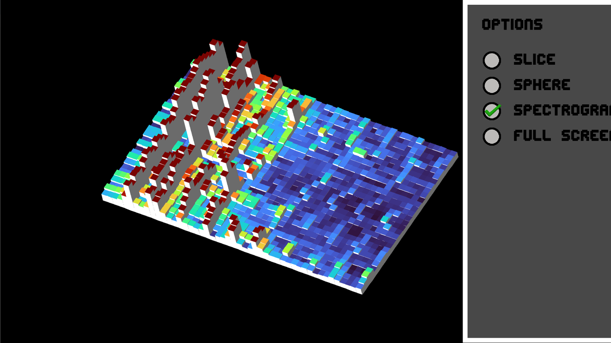
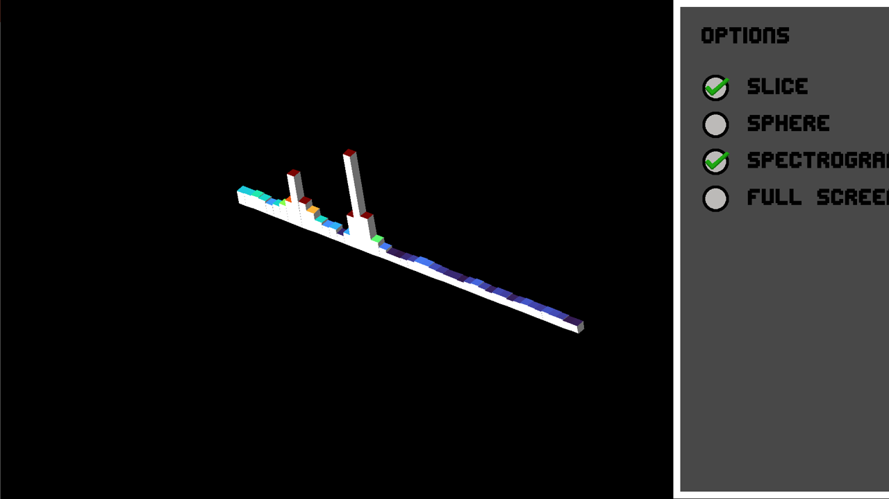
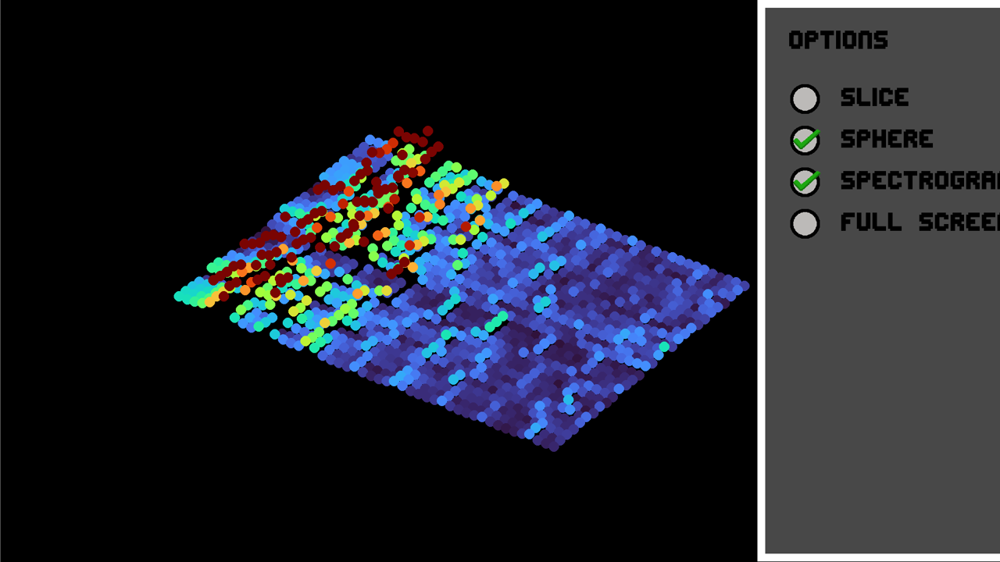
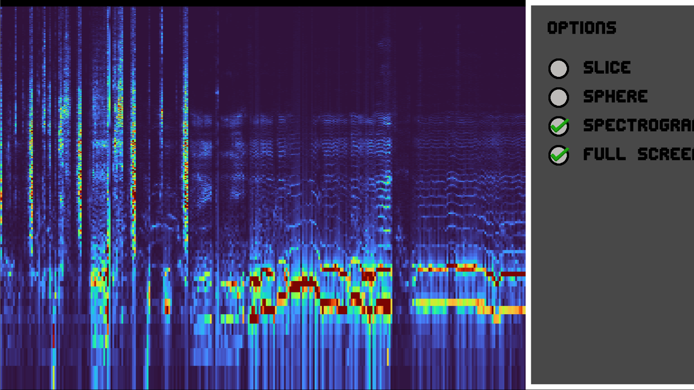

# Audio Processing

<p align="center">
  <a href="https://github.com/Luippe/Demo-Projects/releases/latest/download/Audio-Processing.exe"></a>
</p>

<p align="center">
<em>Prefer the code? <a href="https://download-directory.github.io/?url=https://github.com/Luippe/Demo-Projects/tree/main/Audio%20Processing">Download the source folder</a>.</em></p>

Takes live audio — either your microphone or whatever your computer is playing —
runs an FFT on it, and draws the result in real time four different ways, three of
them in 3D. Echo, pitch-shift, and auto-tune effects are also implemented; they
are off by default and turned on with the `add_echo`, `change_pitch`, and
`auto_tune` flags near the top of `PythonAudioProcessingProject.py`.

## Controls

| Input | Action |
|-------|--------|
| Click the button in the top-right corner | Open the **Options** panel (click to the left of it to close) |
| Click a checkbox | Switch the visualization |
| Left / Right arrow (panel open) | Switch between the two pages of options |
| Click **Mic / PC** under **Input** | Switch between microphone and computer playback audio |
| Left-click and drag | Rotate the 3D view |
| Arrow keys | Rotate around the x- and y-axes |
| `A` / `D` | Rotate around the z-axis |
| `H` | Show / hide the options button |
| `Esc` | Quit |

## The four views

The checkboxes in the **Options** panel switch between four ways of drawing the
same live FFT.

| | |
|---|---|
|  |  |
| **Spectrogram** — the default view. Each row is one FFT frame; rows scroll away from the camera so the surface becomes a waterfall of the last 30 frames. Bar height and colour both track magnitude. | **Slice** — drops the history down to a single row, so you see just the current frame's frequency bins as bars. Useful for reading individual peaks. |
|  |  |
| **Sphere** — the same waterfall, drawn with round markers instead of solid cubes. Lighter to render and easier to see through to the rows behind. | **Full Screen** — the classic 2D spectrogram: frequency on a log scale up the vertical axis, time scrolling right to left, colour for magnitude. |

## Run from source

This is the fussiest demo to set up. It needs **speakers or headphones**, plus a
working microphone for **Mic** mode — on Windows, if no microphone is available it
starts in **PC** mode instead. Two of its packages are harder to install than the
rest:

- **`PyAudioWPatch` (Windows) / `pyaudio` (everywhere else)** depends on the system
  **PortAudio** library. The Windows patch is what provides the WASAPI loopback
  that **PC** mode uses to capture your speakers.
  - macOS: `brew install portaudio`, then `pip install pyaudio`.
  - Debian/Ubuntu: `sudo apt install portaudio19-dev`, then `pip install pyaudio`.
- **`opencv-python`** (imported as `cv2`).

Run it **from inside this folder** — the UI images, font, and sample `.wav` files
are loaded by relative path.

```bash
pip install -r requirements.txt
python PythonAudioProcessingProject.py
```

Opens a resizable 1920×1080 window.
