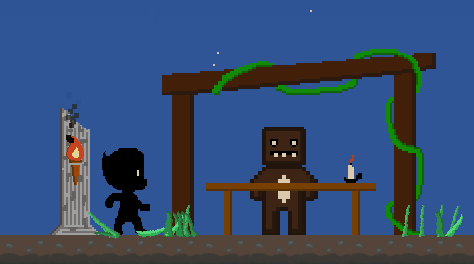

# Platformer

<p align="center">
  <a href="https://github.com/Luippe/Demo-Projects/releases/latest/download/Platformer.exe"></a>
</p>

<p align="center">
<em>Prefer the code? <a href="https://download-directory.github.io/?url=https://github.com/Luippe/Demo-Projects/tree/main/Platformer">Download the source folder</a>.</em></p>

A fullscreen 2D action-platformer built with Python, Pygame, and NumPy, with
animated movement and combat, multiple enemy types, collectible coins, potions,
upgrades, a shop, sound effects, and several layered levels. The game is
unfinished, so expect occasional bugs and soft-locks.

This project could not have been done without the help of **Benedict Wong**, who
created the majority of the artwork for the game and taught me how to draw pixel
art.

<p align="center">
  
</p>

## Controls

| Input | Action |
| --- | --- |
| `A` / `D` | Move left or right |
| `Space` | Jump |
| Left mouse button | Melee attack |
| `W` + left mouse button | Attack upward |
| `E` | Interact with shops, upgrade pedestals, and other objects |
| `R` | Use a healing potion |
| Right mouse button | Activate a nearby sling crystal |
| Left `Shift` | Dash, once it is unlocked |
| `C` | Open the key-binding screen |
| `Esc` | Close the key-binding screen, or exit the game |

Movement and jump keys can be changed from the key-binding screen.

The game renders to a fixed 1920×1080 surface and letterboxes it to your display,
so the layout is identical on every screen size.

## Run from source

Needs **Python 3** with [Pygame](https://www.pygame.org/) and
[NumPy](https://numpy.org/). From inside this folder:

```powershell
py -m venv .venv                      # optional but recommended
.venv\Scripts\Activate.ps1
python -m pip install -r requirements.txt
python platformer.py
```

Launch it from this folder — images, sounds, level data, and the UI font are all
loaded from the local `assets` directory by relative path. On the title screen,
click **Start** to play.

If PowerShell blocks activating the virtual environment, run its Python directly:
`.venv\Scripts\python.exe platformer.py`.

## Level editor and debug controls

The game still ships with its development controls. Press `T` to toggle the level
editor. **Be careful with the save key — it overwrites the level data in
`assets/data`.**

| Input | Action |
| --- | --- |
| Up / Down arrow | Change the active level |
| Backquote/tilde (`` ` `` / `~`) | Toggle between combat and tile-editing mode |
| Left mouse button | Place the selected tile while editing |
| `T` | Toggle the editing grid |
| Left / Right arrow | Switch tile-palette pages |
| `X` | Save the current level layers |
| `Z` | Reload the current level layers |
| `F3` | Toggle the level and FPS display |
| `H` | Toggle hitbox outlines for the player, enemies, and attacks |
| `G` | Toggle god mode (health refills every frame) |
| `K` / `L` | Set the frame rate to 60 / 10 FPS |

Each level is stored in `assets/data` as three pickled layers: `levelN_data`
(collision and gameplay), `levelN_data_bg` (background), and `levelN_data_front`
(foreground). Tile 39 is the shop marker — visible only in tile-editing mode, and
the first one in a level sets the shop's top-left corner.

## Performance profiling

`frame_probe.py` measures where each frame's time goes. It stays inert unless
`PLATFORMER_PROBE` is set to `1`, so it costs nothing during normal play:

```powershell
$env:PLATFORMER_PROBE = '1'; python platformer.py
```

Play for a while, then press `Esc`. A report prints to the console with frame-time
percentiles against the 16.67 ms budget for 60 FPS, a per-section breakdown of
draw cost, every spiked frame, and garbage-collection counts — together enough to
tell whether a stutter came from GC pauses, draw cost, or frame pacing. Turn it
back off with `Remove-Item Env:\PLATFORMER_PROBE`.
