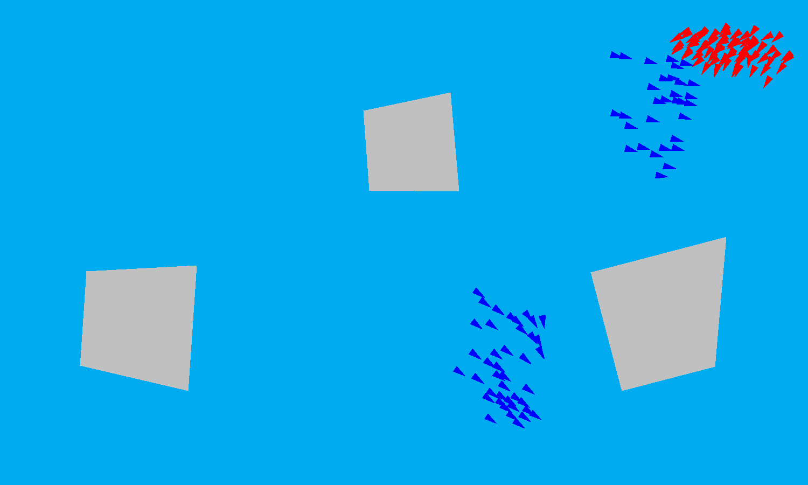

# Demo Projects

A collection of small, interactive simulations and visualizations made sometime around 2021~2025. Most are
written in **Python** with [pygame](https://www.pygame.org/); one (Boids) is
written in **Java**.

**Quickest way to try one:** hit the **⬇ Download** link under any demo in
[the gallery below](#the-demos) the `.exe` downloads straight away, then
double-click it. Every demo closes with **`Esc`**. To see the available controls for each project, click on the project name and take a look at the Controls section.

---

## The demos

Click any preview to open that demo's folder, or **⬇ Download** to grab the
Windows build directly.

<table>
<tr>

<td width="50%" align="center" valign="top">

<h3><a href="./BoidProject">1. Boids</a></h3>

<a href="./BoidProject"></a>

Boids / flocking simulation.

**[⬇ Download `.zip`](https://github.com/Luippe/Demo-Projects/releases/latest/download/Boids-Windows.zip)**

<sub>Java · 46 MB · unzip, run `Boids.exe`</sub>

</td>

<td width="50%" align="center" valign="top">

<h3><a href="./Audio%20Processing">2. Audio Processing</a></h3>

<a href="./Audio%20Processing"></a>

Live mic effects + real-time FFT visuals.

**[⬇ Download `.exe`](https://github.com/Luippe/Demo-Projects/releases/latest/download/Audio-Processing.exe)**

<sub>Python · 111 MB · needs a microphone</sub>

</td>

</tr>
<tr>

<td width="50%" align="center" valign="top">

<h3><a href="./Pathfinding%20Visualization">3. Pathfinding</a></h3>

<a href="./Pathfinding%20Visualization"></a>

Grid path-search visualization.

**[⬇ Download `.exe`](https://github.com/Luippe/Demo-Projects/releases/latest/download/Pathfinding-Visualization.exe)**

<sub>Python · 28 MB</sub>

</td>

<td width="50%" align="center" valign="top">

<h3><a href="./Conway%20Game%20of%20Life">4. Conway</a></h3>

<a href="./Conway%20Game%20of%20Life"></a>

Classic cellular-automaton life simulation.

**[⬇ Download `.exe`](https://github.com/Luippe/Demo-Projects/releases/latest/download/Conway-Game-of-Life.exe)**

<sub>Python · 27 MB</sub>

</td>

</tr>
<tr>

<td width="50%" align="center" valign="top">

<h3><a href="./Image%20Compression">5. Image Compression</a></h3>

<a href="./Image%20Compression"></a>

FFT-based image compression / low-pass filter.

**[⬇ Download `.exe`](https://github.com/Luippe/Demo-Projects/releases/latest/download/Image-Compression.exe)**

<sub>Python · 72 MB</sub>

</td>

<td width="50%" align="center" valign="top">

<h3><a href="./Fluid%20Flow">6. Fluid Flow</a></h3>

<a href="./Fluid%20Flow"></a>

Real-time 2D fluid solver.

**[⬇ Download `.exe`](https://github.com/Luippe/Demo-Projects/releases/latest/download/Fluid-Flow.exe)**

<sub>Python · 27 MB</sub>

</td>

</tr>
<tr>

<td width="50%" align="center" valign="top">

<h3><a href="./Projectile%20Method">7. Projectile Method</a></h3>

<a href="./Projectile%20Method"></a>

Launch/aim a projectile with the mouse.

**[⬇ Download `.exe`](https://github.com/Luippe/Demo-Projects/releases/latest/download/Projectile-Method.exe)**

<sub>Python · 27 MB</sub>

</td>

<td width="50%" align="center" valign="top">

<h3><a href="./Projectile%20Motion">8. Projectile Motion</a></h3>

<a href="./Projectile%20Motion"></a>

Projectile trajectory with drag.

**[⬇ Download `.exe`](https://github.com/Luippe/Demo-Projects/releases/latest/download/Projectile-Motion.exe)**

<sub>Python · 72 MB</sub>

</td>

</tr>
<tr>

<td width="50%" align="center" valign="top">

<h3><a href="./Double%20Pendulum">9. Double Pendulum</a></h3>

<a href="./Double%20Pendulum"></a>

Chaotic double-pendulum motion.

**[⬇ Download `.exe`](https://github.com/Luippe/Demo-Projects/releases/latest/download/Double-Pendulum.exe)**

<sub>Python · 72 MB</sub>

</td>

<td width="50%" align="center" valign="top">

<h3><a href="./Single%20Pendulum">10. Single Pendulum</a></h3>

<a href="./Single%20Pendulum"></a>

Damped single-pendulum motion over time.

**[⬇ Download `.exe`](https://github.com/Luippe/Demo-Projects/releases/latest/download/Single-Pendulum.exe)**

<sub>Python · 72 MB</sub>

</td>

</tr>
<tr>

<td width="50%" align="center" valign="top">

<h3><a href="./Spring%20Mass%20Damper%20System">11. Spring Mass Damper</a></h3>

<a href="./Spring%20Mass%20Damper%20System"></a>

Spring–mass–damper response.

**[⬇ Download `.exe`](https://github.com/Luippe/Demo-Projects/releases/latest/download/Spring-Mass-Damper.exe)**

<sub>Python · 27 MB</sub>

</td>

<td width="50%" align="center" valign="top">

<h3><a href="./Flow%20Plate">12. Flow Plate</a></h3>

<a href="./Flow%20Plate"></a>

Laminar pipe-flow velocity profile.

**[⬇ Download `.exe`](https://github.com/Luippe/Demo-Projects/releases/latest/download/Flow-Plate.exe)**

<sub>Python · 72 MB</sub>

</td>

</tr>
</table>

Most demos open **fullscreen at 1920×1080** — press **`Esc`** to exit. Each demo's
own README lists its controls.

> Every **⬇ Download** link points at this repo's latest
> [GitHub Release](https://github.com/Luippe/Demo-Projects/releases/latest), so it
> always fetches the newest build.

---

## Ways to run a demo

### 1. Download the Windows `.exe` — easiest, no install

Every demo has a **⬇ Download** link in [the gallery above](#the-demos) that pulls
its self-contained **Windows `.exe`** directly — double-click and it runs, nothing
else to install. The links always serve the newest build, and you can also
[browse every file on the release page](https://github.com/Luippe/Demo-Projects/releases/latest).

> **First-launch warning is normal.** Because these `.exe`s aren't code-signed,
> Windows SmartScreen may show a blue *"Windows protected your PC"* box the first
> time. Click **More info → Run anyway**. (Expected for any small indie tool — and
> the full source is right here if you'd rather build it yourself.)

Two demos are packaged a little differently: **Boids** is Java, so it ships as a
portable **`.zip`** (unzip it, then run `Boids.exe` inside the `Boids` folder — its
own Java runtime is bundled), and **Audio Processing** needs a **working microphone
and speakers** to do anything.

### 2. Run from source — any OS

Needs **Python 3.9+**. Grab a demo's source folder (the *source* link at the top of
its own README, or the whole-repo ZIP via the green **Code** button), then:

```bash
cd "Conway Game of Life"
python -m venv .venv                 # optional but recommended
.venv\Scripts\Activate.ps1           # Windows PowerShell  (macOS/Linux: source .venv/bin/activate)
pip install -r requirements.txt
python main.py                       # use the script name from the demo's own README
```

> **Shortcut:** every Python demo *except Audio Processing* runs on the same four
> packages — `pip install pygame numpy scipy matplotlib`.

---

## Notes before you try each one

- **Audio Processing** needs a **working microphone and speakers**. The `.exe`
  bundles everything; from source it also wants `pyaudio` and `opencv-python`,
  which are harder to install than the rest. See its README.
- **BoidProject** is **Java** — the Windows `.zip` bundles its own runtime, so no
  install is needed; building from source needs a JDK. See its README.
- **Flow Plate** and **Image Compression** read data/image files from their own
  folder; the `.exe` builds bundle those automatically, and running from source
  works as long as you launch from inside the folder.

---

## Building the `.exe` files yourself

Most Windows executables are produced from the Python sources with
[PyInstaller](https://pyinstaller.org/) via [`build_installers.py`](./build_installers.py):

```bash
pip install pyinstaller
python build_installers.py            # builds the pygame demos into ./dist/
```

Boids is packaged separately with Java's `jpackage` (see `BoidProject/Build-Boids.ps1`).
The resulting files (in `./dist/`) are published as assets on a
[GitHub Release](https://github.com/Luippe/Demo-Projects/releases) — that's what the
**⬇ Download** links point at, so the asset names must match. See
[`BUILD.md`](./BUILD.md) for the full build-and-release steps.


## Author's Message
Hello, and thank you for checking out my repo for my demo projects, I greatly appreciate it! This is only a small portion of what I've made throughout my years of programming and I wanted a way to share/archive them online. As you can see I dabble in a lot of different things in programming, but most of these projects started out from pure curiosity and interest in learning something new. And I enjoy making visualizations out of them to share my results. I have quite a bit more projects I want to clean up and upload onto github, so I'll be working on that for a while. Anyways, thank you again for taking a look at my projects!