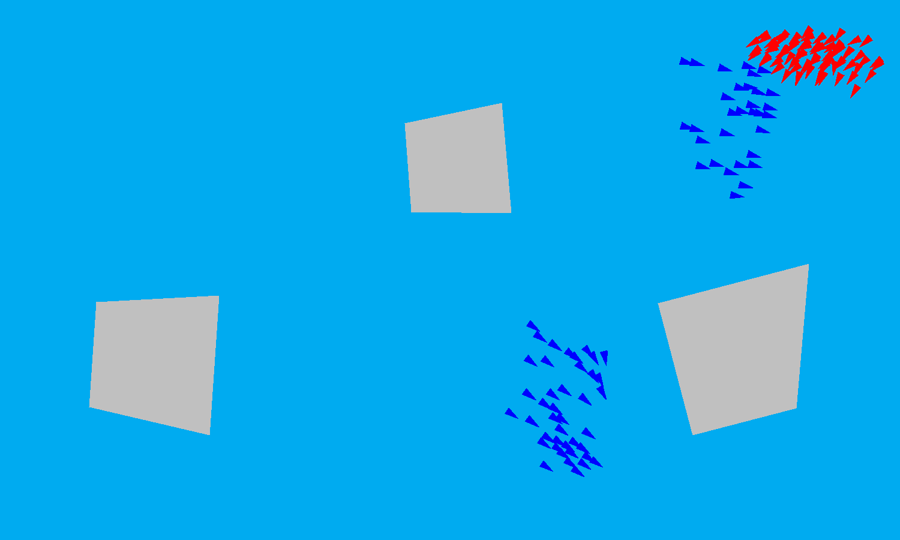
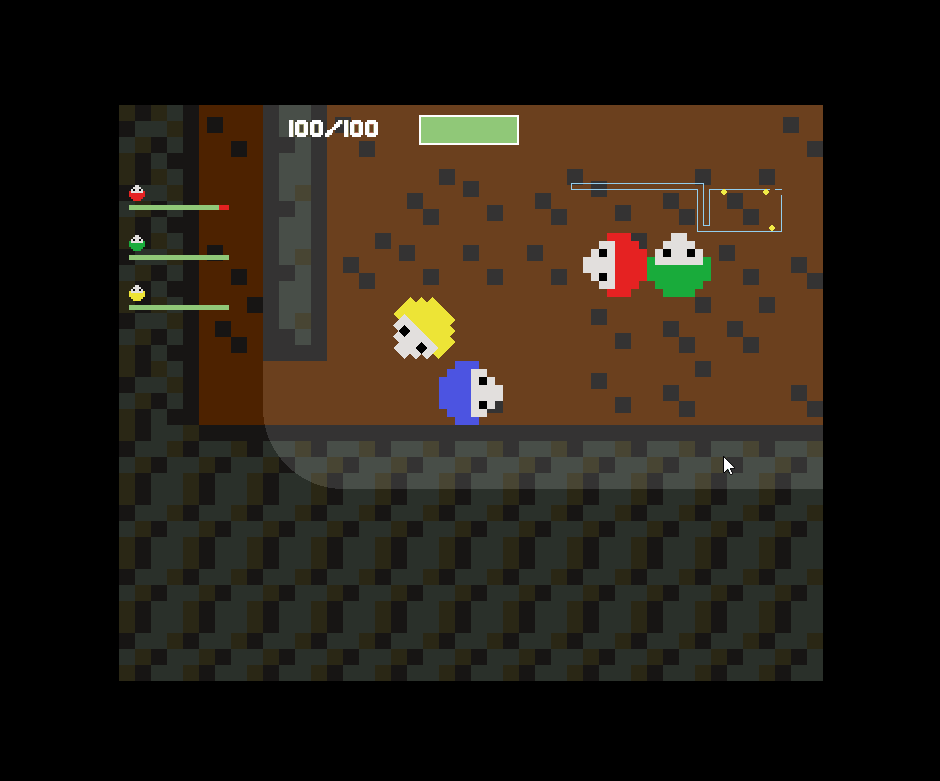

# Demo Projects

Welcome to my collection of simulations, visualizations, and games built over the
past several years. Most are written in **Python** with
[pygame](https://www.pygame.org/); one (Boids) is written in **Java**.

**Quickest way to try one:** click the **⬇ Download** link under any demo in
[the gallery below](#the-demos), then double-click the file that downloads — no
install needed. If Windows shows a *"Windows protected your PC"* box, click
**More info → Run anyway**; that just means the file isn't code-signed. Press
**`Esc`** to quit any demo.

---

## The demos

Click a demo's title or preview image to open its folder and see its controls, or
click **⬇ Download** to grab the Windows build directly.

<table>
<tr>

<td width="50%" align="center" valign="top">

<h3><a href="./BoidProject">1. Boids</a></h3>

<a href="./BoidProject"></a>

Boids / flocking simulation.

**[⬇ Download `.zip`](https://github.com/Luippe/Demo-Projects/releases/latest/download/Boids-Windows.zip)**

<sub>Java · 46 MB · unzip, run `Boids.exe`</sub>

</td>

<td width="50%" align="center" valign="top">

<h3><a href="./Audio%20Processing">2. Audio Processing</a></h3>

<a href="./Audio%20Processing"></a>

Live mic effects + real-time FFT visuals.

**[⬇ Download `.exe`](https://github.com/Luippe/Demo-Projects/releases/latest/download/Audio-Processing.exe)**

<sub>Python · 111 MB · needs a microphone</sub>

</td>

</tr>
<tr>

<td width="50%" align="center" valign="top">

<h3><a href="./netgame">3. Multiplayer Netgame</a></h3>

<a href="./netgame"></a>

Cooperative multiplayer dungeon prototype.

**[⬇ Download `.exe`](https://github.com/Luippe/Demo-Projects/releases/latest/download/Netgame.exe)**

<sub>Python · 70 MB · Requires local LAN for multiplayer</sub>

</td>

<td width="50%" align="center" valign="top">

<h3><a href="./Platformer">4. Platformer</a></h3>

<a href="./Platformer"></a>

Fullscreen 2D action platformer with combat, upgrades, shops, and multiple levels.

**[⬇ Download `.exe`](https://github.com/Luippe/Demo-Projects/releases/latest/download/Platformer.exe)**

<sub>Python · 38 MB</sub>

</td>

</tr>
<tr>

<td width="50%" align="center" valign="top">

<h3><a href="./Solar%20System%20Simulation">5. Solar System Simulation</a></h3>

<a href="./Solar%20System%20Simulation"></a>

Interactive 3D solar-system simulation.

**[⬇ Download `.exe`](https://github.com/Luippe/Demo-Projects/releases/latest/download/Solar-System-Simulation.exe)**

<sub>Python · 77 MB</sub>

</td>

<td width="50%" align="center" valign="top">

<h3><a href="./Pathfinding%20Visualization">6. A* Pathfinding</a></h3>

<a href="./Pathfinding%20Visualization"></a>

Visualization of the A* pathfinding algorithm.

**[⬇ Download `.exe`](https://github.com/Luippe/Demo-Projects/releases/latest/download/Pathfinding-Visualization.exe)**

<sub>Python · 28 MB</sub>

</td>

</tr>
<tr>

<td width="50%" align="center" valign="top">

<h3><a href="./Conway%20Game%20of%20Life">7. Conway's Game of Life</a></h3>

<a href="./Conway%20Game%20of%20Life"></a>

Classic cellular-automaton life simulation.

**[⬇ Download `.exe`](https://github.com/Luippe/Demo-Projects/releases/latest/download/Conway-Game-of-Life.exe)**

<sub>Python · 27 MB</sub>

</td>

<td width="50%" align="center" valign="top">

<h3><a href="./Image%20Compression">8. Image Compression</a></h3>

<a href="./Image%20Compression"></a>

FFT-based image compression / low-pass filter.

**[⬇ Download `.exe`](https://github.com/Luippe/Demo-Projects/releases/latest/download/Image-Compression.exe)**

<sub>Python · 72 MB</sub>

</td>

</tr>
<tr>

<td width="50%" align="center" valign="top">

<h3><a href="./Fluid%20Flow">9. Fluid Flow</a></h3>

<a href="./Fluid%20Flow"></a>

Real-time 2D fluid solver.

**[⬇ Download `.exe`](https://github.com/Luippe/Demo-Projects/releases/latest/download/Fluid-Flow.exe)**

<sub>Python · 27 MB</sub>

</td>

<td width="50%" align="center" valign="top">

<h3><a href="./Projectile%20Method">10. Projectile Method</a></h3>

<a href="./Projectile%20Method"></a>

Launch/aim a projectile with the mouse.

**[⬇ Download `.exe`](https://github.com/Luippe/Demo-Projects/releases/latest/download/Projectile-Method.exe)**

<sub>Python · 27 MB</sub>

</td>

</tr>
<tr>

<td width="50%" align="center" valign="top">

<h3><a href="./Projectile%20Motion">11. Projectile Motion</a></h3>

<a href="./Projectile%20Motion"></a>

Projectile trajectory with drag.

**[⬇ Download `.exe`](https://github.com/Luippe/Demo-Projects/releases/latest/download/Projectile-Motion.exe)**

<sub>Python · 72 MB</sub>

</td>

<td width="50%" align="center" valign="top">

<h3><a href="./Double%20Pendulum">12. Double Pendulum</a></h3>

<a href="./Double%20Pendulum"></a>

Chaotic double-pendulum motion.

**[⬇ Download `.exe`](https://github.com/Luippe/Demo-Projects/releases/latest/download/Double-Pendulum.exe)**

<sub>Python · 72 MB</sub>

</td>

</tr>
<tr>

<td width="50%" align="center" valign="top">

<h3><a href="./Single%20Pendulum">13. Single Pendulum</a></h3>

<a href="./Single%20Pendulum"></a>

Damped single-pendulum motion over time.

**[⬇ Download `.exe`](https://github.com/Luippe/Demo-Projects/releases/latest/download/Single-Pendulum.exe)**

<sub>Python · 72 MB</sub>

</td>

<td width="50%" align="center" valign="top">

<h3><a href="./Spring%20Mass%20Damper%20System">14. Spring Mass Damper</a></h3>

<a href="./Spring%20Mass%20Damper%20System"></a>

Spring–mass–damper response.

**[⬇ Download `.exe`](https://github.com/Luippe/Demo-Projects/releases/latest/download/Spring-Mass-Damper.exe)**

<sub>Python · 27 MB</sub>

</td>

</tr>
<tr>

<td width="50%" align="center" valign="top">

<h3><a href="./Flow%20Plate">15. Flow Plate</a></h3>

<a href="./Flow%20Plate"></a>

Laminar pipe-flow velocity profile.

**[⬇ Download `.exe`](https://github.com/Luippe/Demo-Projects/releases/latest/download/Flow-Plate.exe)**

<sub>Python · 72 MB</sub>

</td>

</tr>
</table>

Most demos open **fullscreen at 1920×1080** and quit with **`Esc`**.

> Every **⬇ Download** link points at this repo's latest
> [GitHub Release](https://github.com/Luippe/Demo-Projects/releases/latest), so it
> always fetches the newest build. **Boids** is the one `.zip` — unzip it and run
> `Boids.exe` inside the `Boids` folder.

---

## Running from source

Works on any OS and needs **Python 3.9+**. Every demo folder has its own
`requirements.txt` and its own entry script (named in that demo's README):

```bash
cd "Conway Game of Life"
python -m venv .venv                 # optional but recommended
.venv\Scripts\Activate.ps1           # Windows PowerShell  (macOS/Linux: source .venv/bin/activate)
pip install -r requirements.txt
python main.py
```

Always launch a demo **from inside its own folder** — several of them load images,
fonts, or data tables by relative path. Two need extra care:

- **Audio Processing** needs speakers, plus a microphone for mic mode. It also
  needs `pyaudio` and `opencv-python`, the fiddliest packages here.
- **Boids** is Java, not Python — building it from source needs **JDK 17+**.

---

## Building the `.exe` files yourself

The Python demos are packaged with [PyInstaller](https://pyinstaller.org/) via
[`build_installers.py`](./build_installers.py); Boids uses Java's `jpackage`
(`BoidProject/Build-Boids.ps1`).

```bash
pip install pyinstaller
python build_installers.py            # builds into ./dist/
```

[`BUILD.md`](./BUILD.md) has the full build-and-release steps.

---

## Author's Message
Hello, and thank you for checking out my repo for my demo projects, I greatly appreciate it! This is only a small portion of what I've made throughout my years of programming and I wanted a way to share/archive them online. As you can see I dabble in a lot of different things in programming, but most of these projects started out from pure curiosity and interest in learning something new. And I enjoy making visualizations out of them to share my results. Thank you again for taking a look at my projects!
